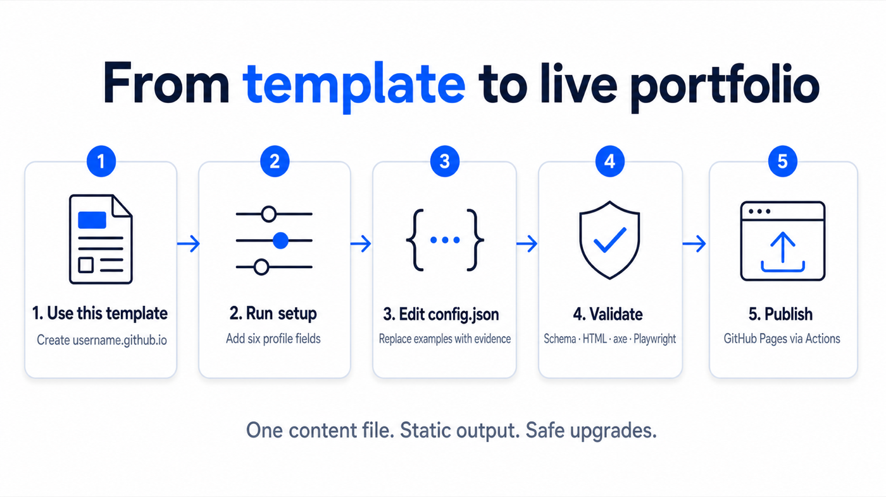
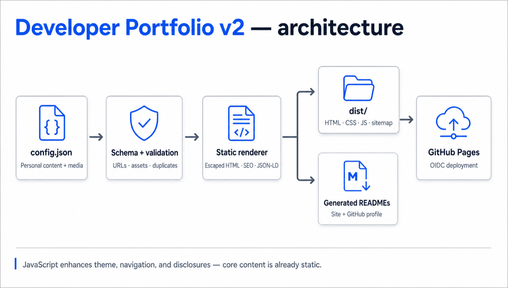

# Developer Portfolio v2

A schema-driven static portfolio for developers, DevRel practitioners, and technical community leaders. Edit one JSON file; the engine validates it, generates meaningful HTML and SEO metadata, and deploys the finished `dist/` site through GitHub Pages.

[View the HTTPS demo](https://yashrajnayak.github.io/developer-portfolio/) · [Read the v2 configuration guide](docs/CONFIGURATION.md)



## Quick start

1. Select **Use this template** and create a public repository named `YOUR_USERNAME.github.io`.
2. Open **Actions → Set up portfolio → Run workflow** and provide the six requested profile fields.
3. Edit `config.json` to replace the example impact, projects, experience, and links with your own evidence.
4. In **Settings → Pages**, choose **GitHub Actions** as the source if GitHub has not selected it automatically.
5. Open `https://YOUR_USERNAME.github.io` after **Deploy portfolio** succeeds.

The setup workflow changes only `config.json`, `README.md`, and template-only README graphics. The deploy workflow always validates the schema, generated HTML, links, local paths, unit tests, accessibility, and responsive browser tests before publishing.

## Why v2

- **Static first:** the title, description, avatar, headings, case studies, experience, contact links, and JSON-LD exist before JavaScript runs.
- **One source of truth:** `config.json` drives the site, SEO, site README, and optional GitHub profile README.
- **Beginner-friendly validation:** `config.schema.json` provides editor autocomplete while the CLI reports duplicate content, invalid HTTPS URLs, missing assets, and unsupported navigation targets.
- **Accessible by design:** semantic landmarks, skip navigation, native disclosures, visible focus, 44px controls, reduced-motion support, and automated axe coverage.
- **Fast and portable:** vanilla HTML, CSS, and JavaScript with no client framework or runtime API dependency.
- **Safe upgrades:** schema v1 remains readable through the v2 compatibility migration for one major release.

## Local development

Requirements: Node.js 20 or newer.

```bash
npm ci
npm run validate
npm run dev
```

Open `http://127.0.0.1:4173`. Run `npm run validate:all` before a pull request; it adds Playwright and axe acceptance coverage to the normal validation.

Useful commands:

```bash
npm run migrate -- path/to/v1-config.json path/to/v2-config.json
PORTFOLIO_CONFIG=/path/to/config.json npm run build
node scripts/generate-readmes.mjs config.json SITE_README.md PROFILE_README.md
```

## Architecture



The engine never renders core content in the browser. `scripts/build.mjs` validates and normalizes the configuration, escapes content, renders the page and structured data, copies reusable assets, and writes deployable files to `dist/`. `src/app.js` only enhances theme selection, the mobile menu, and responsive disclosures.

See [Architecture](docs/ARCHITECTURE.md) for the build contract and [Configuration](docs/CONFIGURATION.md) for every v2 section.

## Contributing and security

Read [CONTRIBUTING.md](CONTRIBUTING.md) before opening a pull request. Report security issues through GitHub private vulnerability reporting as described in [SECURITY.md](SECURITY.md). Release history is recorded in [CHANGELOG.md](CHANGELOG.md).

## License

[MIT](LICENSE)
